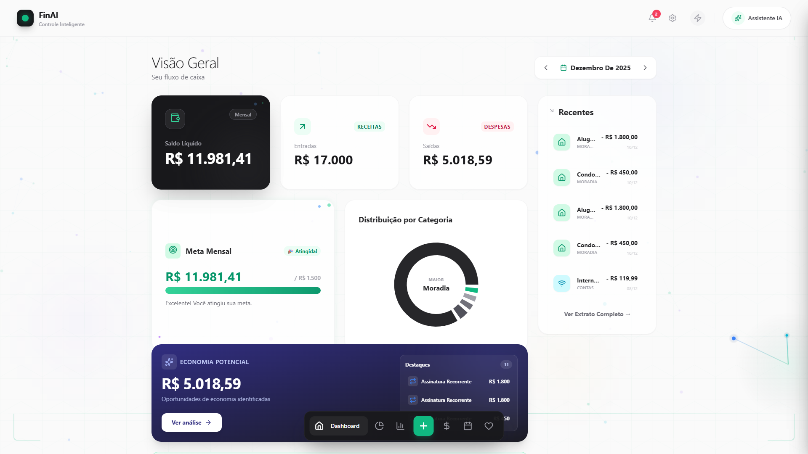
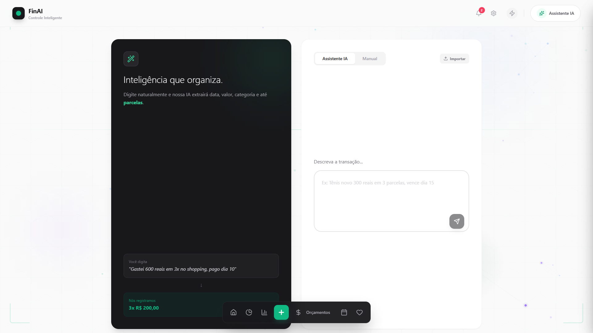
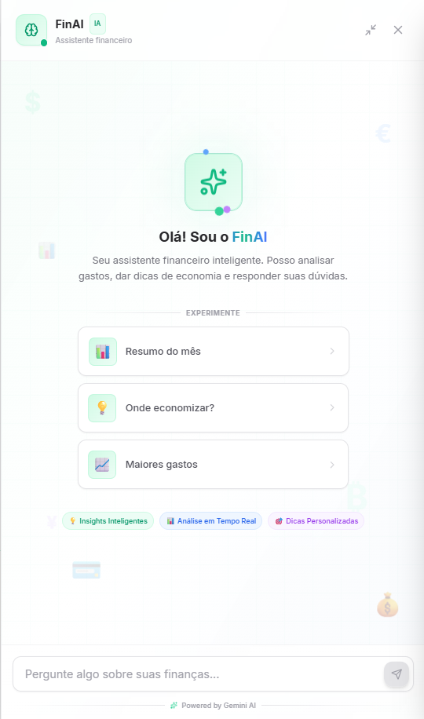
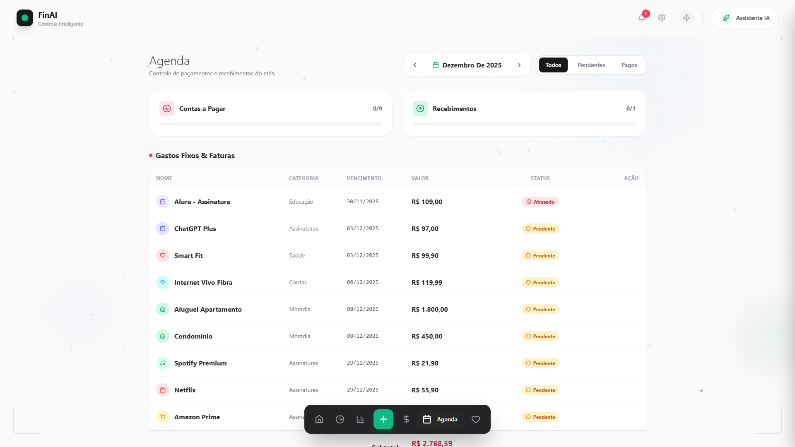
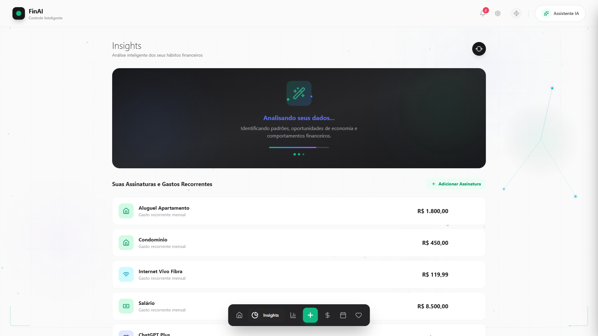
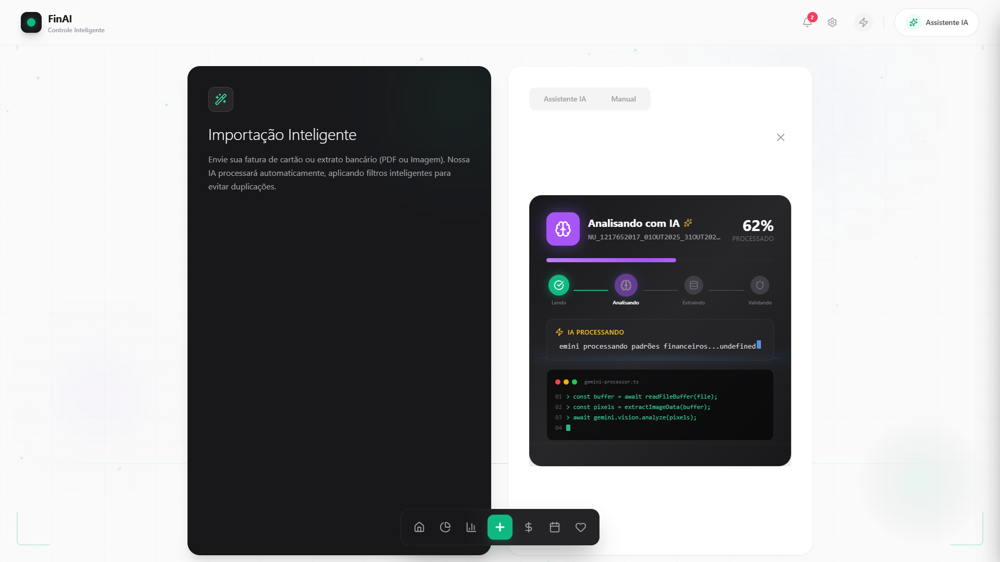

<p align="center">
  
</p>

<h1 align="center">💰 FinAI - Controle Financeiro Inteligente</h1>

<p align="center">
  <strong>Seu assistente financeiro pessoal com Inteligência Artificial</strong>
</p>

<p align="center">
  
  
  
  
  
</p>

<p align="center">
  <a href="#-sobre">Sobre</a> •
  <a href="#-funcionalidades">Funcionalidades</a> •
  <a href="#-screenshots">Screenshots</a> •
  <a href="#-como-surgiu">Como Surgiu</a> •
  <a href="#-tecnologias">Tecnologias</a> •
  <a href="#-como-usar">Como Usar</a>
</p>

---

## 📖 Sobre

O **FinAI** é um aplicativo de controle financeiro pessoal que utiliza Inteligência Artificial para ajudar você a entender seus gastos, planejar seus sonhos e tomar decisões financeiras mais inteligentes.

> ⚠️ **Transparência**: Este projeto foi iniciado a partir de um template do [Google AI Studio](https://aistudio.google.com/) e evoluído significativamente com a ajuda do [Claude](https://claude.ai/) (Anthropic) e [Kiro](https://kiro.dev/). Acredito na importância de ser honesto sobre o uso de ferramentas de IA no desenvolvimento.

---

## ✨ Funcionalidades

### 🤖 Inteligência Artificial
- **Chat Inteligente** - Converse com a IA sobre suas finanças
- **Categorização Automática** - A IA categoriza suas transações automaticamente
- **Análise de Viabilidade** - Descubra quando você pode realizar seus sonhos
- **Insights Personalizados** - Receba dicas baseadas no seu perfil de gastos

### 📊 Dashboard Completo
- Visão geral de receitas e despesas
- Gráficos interativos por categoria
- Projeção de gastos do mês
- Histórico de transações

### 📥 Importação Inteligente
- Importe faturas de cartão (PDF, Excel, texto)
- A IA extrai e categoriza automaticamente
- Suporte a múltiplos bancos brasileiros

### 🎯 Lista de Desejos
- Adicione seus objetivos financeiros
- A IA pesquisa preços e analisa viabilidade
- Acompanhe seu progresso de economia
- Simulação de parcelamento

### 📅 Agenda Financeira
- Visualize contas a pagar
- Controle de recorrências
- Alertas de vencimento

### ☁️ Sincronização
- Seus dados salvos na nuvem (Firebase)
- Acesse de qualquer dispositivo
- Funciona offline (PWA)

---

## 📸 Screenshots

<p align="center">
  
  
</p>

<p align="center">
  
  
</p>

<p align="center">
  
  
</p>

---

## 🚀 Como Surgiu

Estava querendo aprender mais sobre IA aplicada e pensei: por que não fazer algo que eu realmente usaria?

### O Processo

Comecei explorando o Google AI Studio e encontrei um template de app financeiro. Achei interessante e decidi usar como ponto de partida pra entender como funciona a integração com o Gemini AI.

Daí fui expandindo as funcionalidades com ajuda do Claude e do Kiro - refatorando código, implementando novas features e aprendendo React e TypeScript na prática. Foi um processo bem iterativo: tinha uma ideia, implementava, testava, melhorava.

O resultado é um app que uso diariamente pra controlar minhas finanças e que virou um projeto de portfolio bacana. Aprendi bastante sobre desenvolvimento com IA, e mais importante: aprendi que essas ferramentas são ótimas quando você sabe o que quer construir e entende o que elas estão gerando.

> 💡 Ferramentas de IA ajudam demais no desenvolvimento, mas o projeto, as decisões e o aprendizado são seus. Só quis ser transparente sobre como construí isso.

---

## 🛠️ Tecnologias

| Categoria | Tecnologia |
|-----------|------------|
| **Frontend** | React 19, TypeScript, Tailwind CSS |
| **Build** | Vite |
| **IA** | Google Gemini AI |
| **Backend** | Firebase (Auth, Firestore) |
| **Gráficos** | Recharts |
| **Ícones** | Lucide React |
| **PWA** | Service Worker, Web Manifest |

---

## 💻 Como Usar

### Pré-requisitos
- Node.js 18+
- Conta no Google AI Studio (para API key do Gemini)
- Conta no Firebase (opcional, para sincronização)

### Instalação

```bash
# Clone o repositório
git clone https://github.com/seu-usuario/finai.git

# Entre na pasta
cd finai

# Instale as dependências
npm install

# Configure as variáveis de ambiente
cp .env.example .env.local
# Edite .env.local com suas chaves

# Inicie o servidor de desenvolvimento
npm run dev
```

### Variáveis de Ambiente

```env
VITE_GEMINI_API_KEY=sua_chave_gemini
VITE_FIREBASE_API_KEY=sua_chave_firebase
VITE_FIREBASE_AUTH_DOMAIN=seu_projeto.firebaseapp.com
VITE_FIREBASE_PROJECT_ID=seu_projeto
```

---

## 🎬 Demo

Quer ver o app em ação sem configurar nada?

1. Acesse as **Configurações** ⚙️
2. Role até o final
3. Clique em **"Ativar Modo Demo"**
4. Explore com dados fictícios!

---

## 📝 Licença

Este projeto está sob a licença MIT. Veja o arquivo [LICENSE](LICENSE) para mais detalhes.

---

## 🙏 Agradecimentos

- [Google AI Studio](https://aistudio.google.com/) - Template inicial e API Gemini
- [Anthropic Claude](https://claude.ai/) - Assistência no desenvolvimento
- [Kiro](https://kiro.dev/) - IDE com IA integrada
- Comunidade open source pelos pacotes incríveis

---

<p align="center">
  Feito com ❤️ e muita ajuda de IA
</p>

<p align="center">
  <a href="https://linkedin.com/in/seu-perfil">
    
  </a>
  <a href="https://github.com/seu-usuario">
    
  </a>
</p>
